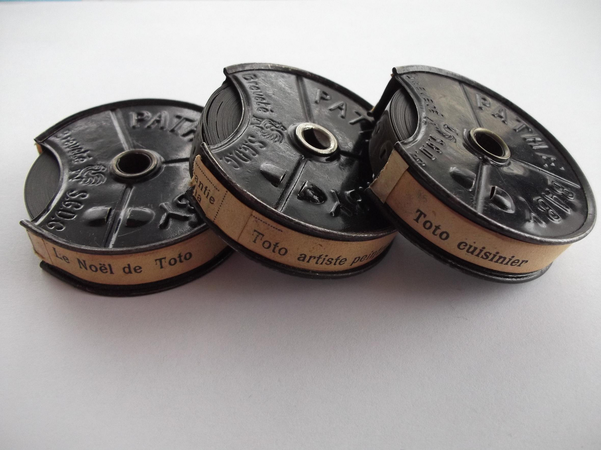
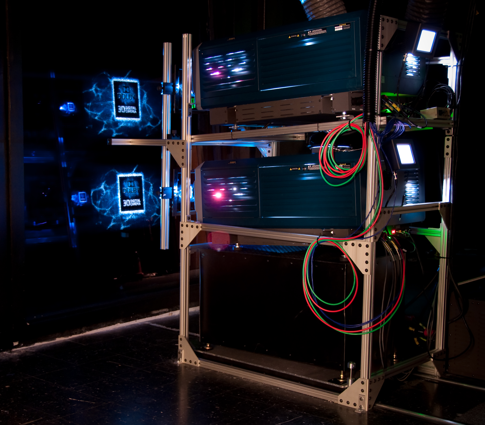
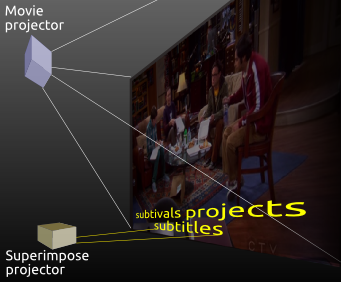
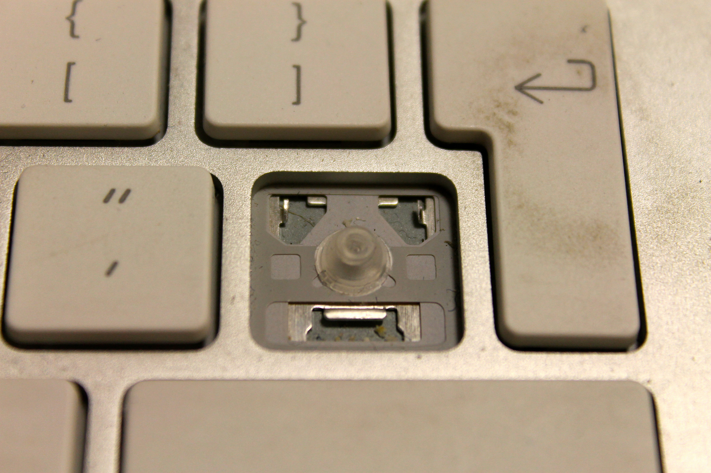
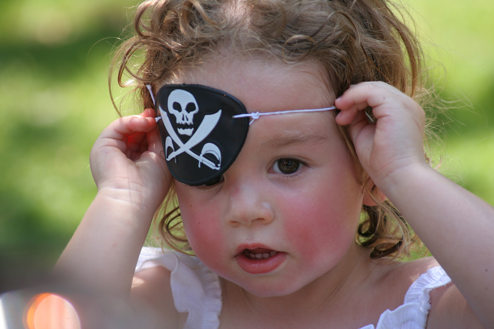
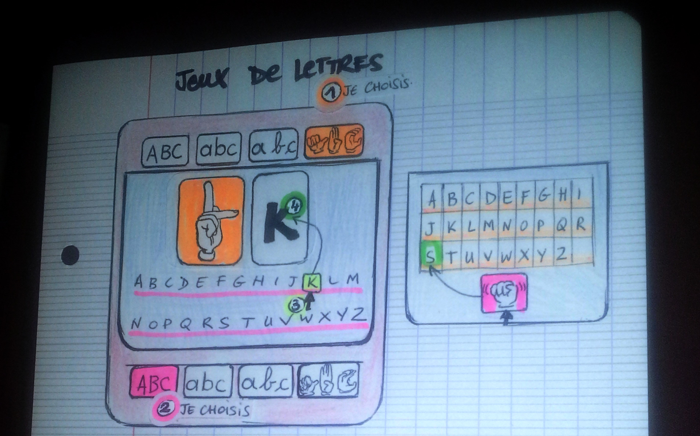
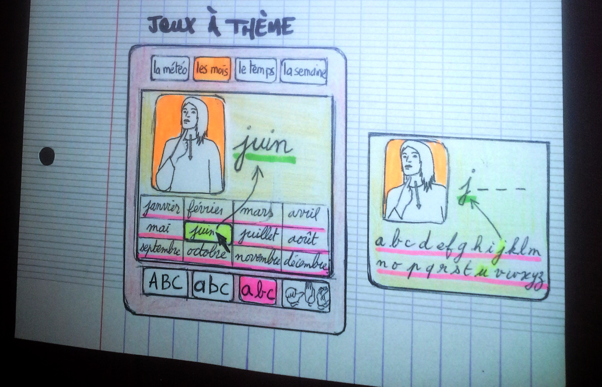
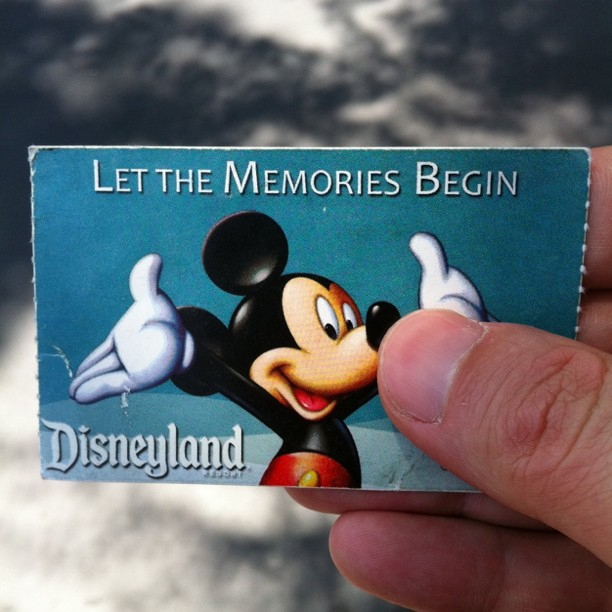

Subtivals
=========

.. image:: images/subtivals-logo.png

----

Un projet...
============

* La petite histoire
* L'aventure
* Le bonheur
* Le partage

----

LA PETITE HISTOIRE
==================

----

À cause de ça...
================

Presenter Notes
===============

* Une copie 35 mm coûte entre 1000 et 1500 €

----

Et puis à cause de ça...
========================

Presenter Notes
===============

* Monopole
* Certificats et clés de chiffrement
* `Digital Cinema Tools <https://github.com/wolfgangw/digital_cinema_tools_distribution/wiki>`_

----

Sur-titres
==========

----

Avant Subtivals
===============

Presenter Notes
===============

* 10 ans de Powerpoint en manuel

----

La solution !
=============

.. raw:: html

    <video src="images/subtivals-1.6-calibration.webm" width="80%" preload="auto" autoplay="" loop=""/>

L'AVENTURE
==========

----

Pour quelques-uns
=================

Presenter Notes
===============

* Ne viens pas présenter Subtivals en fait :)
* Sous-titrage pour sourds et malentendants

----

Puis les festivals
==================

Presenter Notes
===============

* Projections étrangères

----

Puis l'opéra
============

Presenter Notes
===============

* Encore... powerpoint !

----

Et plus encore !
================

Presenter Notes
===============

* Théatre, TEDx, festilight, ...
* ~ 20 pays
* International (Japon, Brésil, Europe de l'Est, USA, ...)

----

LE BONHEUR
==========

----

Moi, avant.
===========

Presenter Notes
===============

* Nombre d'utilisateurs : 0.5
* Technico-technique

----

Code simple ➙ usage illimités
==============================

Presenter Notes
===============

* Rappel: 10 ans de Powerpoint en manuel !

----

C'est zouli
===========

Presenter Notes
===============

* Site Web (template 9$)

----

Des rencontres
==============

Presenter Notes
===============

* Festival CineLatino
* Association sens dessus dessous
* Impression de voyager

----

« Bruno's approach »
====================

Presenter Notes
===============

* Bonne nouvelle: on le vend
* La Banque m'appelle...

----

Du C++ généreux
===============

Presenter Notes
===============

* sur le CV !
* Bonnes pratiques
* Packaging
* ...

----

Pour de vrai
============

Presenter Notes
===============

* Dehors, les vrais gens
* Apprendre à communiquer
* Observer
* Promouvoir

----

LE PARTAGE
==========

----

Reproduire l'expérience
=======================

Presenter Notes
===============

* 2 enfants tout ça
* À vous !

----

Pas d'idée ?
============

Presenter Notes
===============

* Scratch your own itch
* Corps sain, esprit sain
* Autrui

----

Libre mais pas seulement
========================

Presenter Notes
===============

* Le Libre ne sauvera pas le Monde
* Outils conviviaux (Ivan Illich)

----

Accessible mais surtout adapté
==============================

Presenter Notes
===============

* Les sourds n'entendent pas !
* Les sourds ne sont pas tous aveugles !
* Peu pour les sourds

----

Idée #1 : jeu de lecture
========================

Presenter Notes
===============

* Pas de méthode unanime
* Apprendre en s'amusant
* Relier les signes aux mots
* Mémoriser l'orthographe
* Apprendre les signes pour les autres !
* GCompris QML ?

----

Majuscules, minuscules, cursive, signes

----

Thèmes, signes et mots

----

Idée #2 : aide à la routine
===========================

Presenter Notes
===============

* Alzheimer
* Rappels vocaux à intervalles réguliers
* Outil universel !
* Cycles vs. horaires

----

Idées N+1
=========

* Cinéma numérique
* Mains bioniques
* `Anki + LSF <http://fr.wikipedia.org/wiki/Anki>`_
* `Blender + LSF <https://www.youtube.com/watch?v=QKXvKIC4gkY>`_
* ...

----

Allôo ?
=======

* Temps libre
* Associations
* Projets d'écoles
* Hackathons
* Crowdsourcing

----

MERCI !
=======

Mathieu Leplatre - http://subtivals.org
